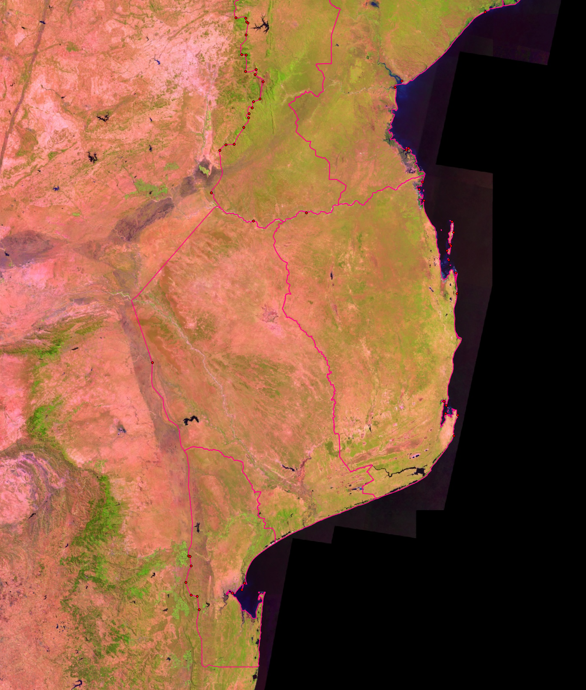
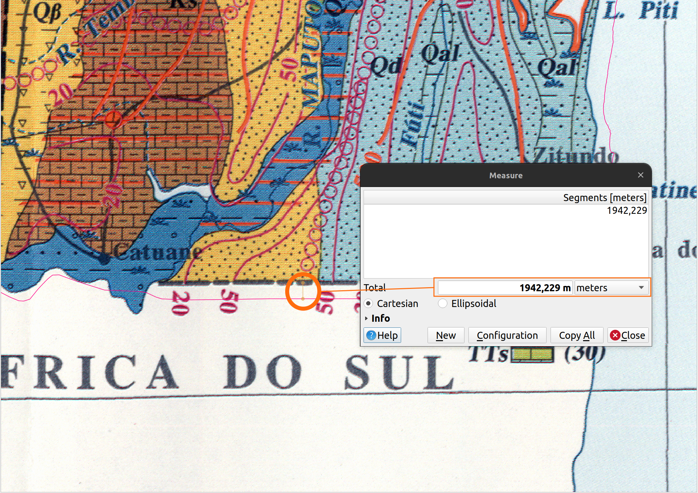
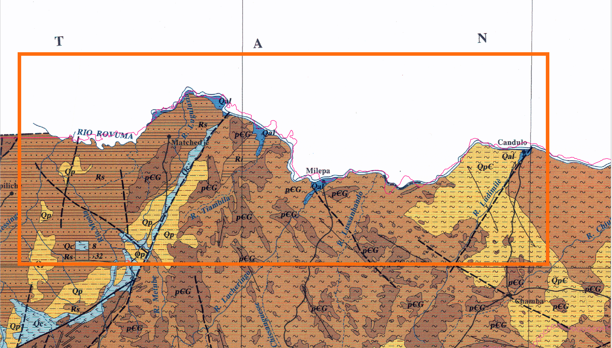
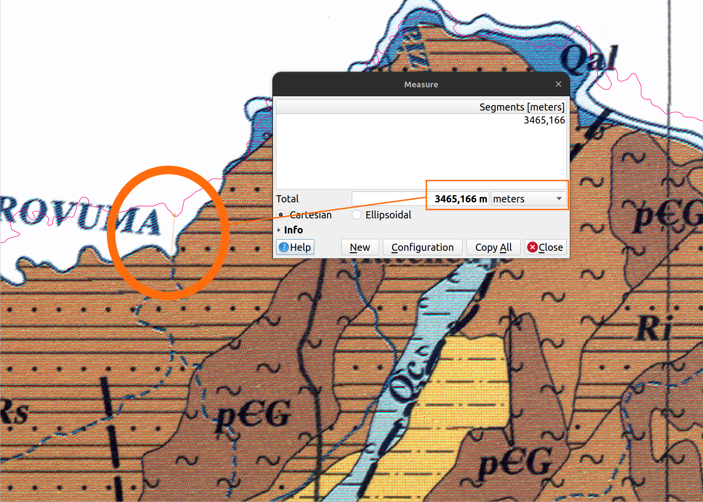
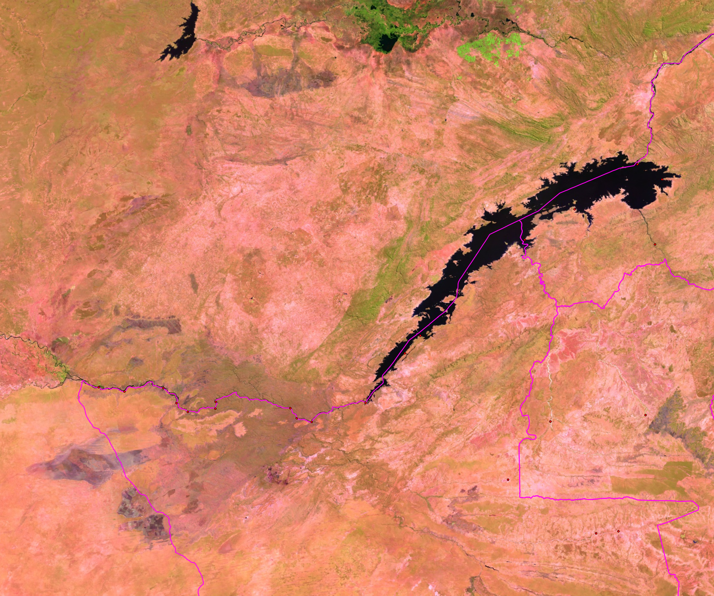

# IGRAC: Georeferencing Methodology

## Mozambique

1. Create a QGIS project for Mozambique and import the Mozambique Hidrogeological Map_North Region and Mozambique Hidrogeological Map_South Region tifs into the project.

2. Find the GAUL dataset, as this was the suggested reference dataset. The dataset was downloaded from [here](https://geonode.wfp.org/geoserver/wfs?format_options=charset%3AUTF-8&typename=geonode%3Aadm1_gaul_2015&outputFormat=SHAPE-ZIP&version=1.0.0&service=WFS&request=GetFeature).

3. The Coordinate Reference System (CRS) for the Mozambique tifs was unknown. In the  "Legenda" (legend) on the Mozambique Hidrogeological Map_South Region image, it is stated "Projeccao Conica Conforme de Lambert" (Lambert Conic Conformal Projection). The Lambert Conic Conformal Projection requires two parallels, a central meridian, and a Datum. The two parallels and the central meridian were obtained from the scanned maps, and then through research the datum was discovered to be the Tete datum (discovered through this [column](https://www.ingentaconnect.com/contentone/asprs/pers/2017/00000083/00000005/art00005?crawler=true&mimetype=application/pdf) by Clifford J. Mugnier for ASPRS.org). A custom CRS was the made using that information.

4. The custom CRS using the Tete datum worked but, due to lack of information on the scanned images, was not accurate for georeferencing. A new custom CRS based on the WGS84 datum was made using the proj4 string:

```
+proj=lcc +lat_0=0 +lon_0=35.5 +lat_1=-14 +lat_2=-24 +x_0=0 +y_0=0 +datum=WGS84 +untis=m +no_defs
```

The new CRS was made to save having to datum transformations in the future. It was then decided that georeferencing would be done using the GAUL dataset for reference points because a graticule transformation was not possible.

### Georeferencing Mozambique Southern Region

>Multiple iterations were required as the georeferencing was done against a reference dataset and could not be done by simply taking the corner graticules from the tifs and projecting them into the custom CRS.

1. The first iteration of georeferencing the Southern Region of Mozambique was done using a linear transformation. The resulting image ended up being too different to the reference dataset spatially and so was immediately discarded.


2. The second iteration was done using a Helmert transformation and gave a decent result but there were far too many discrepancies between the reference layer and the georeferenced image.

3. The third iteration was done using the Helmert Transform again but with all Residual pixels for the Ground Control Points (CPs) being under 10. 9 GCPS were used for the referencing. There were too many discrepancies between the reference dataset and the georeferenced image so it was disregarded as a viable image.

4. The fourth iteration was done using a Polynomial 1 Transformation (with all residual pixels less than 10) and 12 GCPs. Again, there were too many discrepancies between the reference dataset and the georeferenced image but there was minimal warping on the polygons.

5. The fifth iteration was done using a Polynomial 2 Transformation (with all residual pixels less than 10) and 17 GCPs. There were fewer discrepancies between the reference dataset and the georeferenced image than in the previous iterations but there was slight warping on the polygons.

6. The sixth iteration was done using a Polynomial 3 Transformation (with all residual pixels less than 10) and 18 GCPs. There were fewer discrepancies between the reference dataset and the georeferenced image than in the previous iterations but there was warping on the polygons.

7. The seventh iteration was done using a Thin Plate Spline transformation. All residual pixels were zero but this was likely a false result. This iteration had the best results for lining up the georeferenced image with the reference dataset. 102 GCPs were used to help correct discrepancies from previous iterations. The issue with this transformation was the significant warping of the polygons in the georeferenced image.

8. For the last iteration, it was decided that the Polynomial 1 transformation warped the internal polygons of Mozambique's Southern Region the least but more GCPs would help with the discrepancies between the reference dataset and the tif. 55 GCPs, with residual pixels lower than 10, were used for the georeferencing and ended up with the best result. The image below shows the georeferencer with the GCPs on the map and the GCP table showing the residuals being below 10 (Ground Control Point 40 has the highest Residual Pixels at 8.976885).


    The image below shows the GCPs for Mozambique's Southern Region relative to the GAUL reference dataset.


    The GCPs for Mozambique's Southern Region can be found [here](gcps/MozSouth_Poly1.points). There were still small discrepancies between the georeferenced image and the reference dataset but to correct the discrepancies would warp the polygons too much to be a viable image.

### Georeferencing Mozambique Northern Region

>Fewer iterations were required for the Northern Region of Mozambique as it was done using knowledge gained from georeferencing the Southern Region. The first 2 iterations were also done before the final iteration of georeferencing the Zouth Region of Mozambique so were done before it was decided that using the Thin Plate Spline transformation was providing false results.

1. The first iteration was done using the Thin Plate Spline transformation where all the residual pixels were a false zero. 10 GCPs were used and resulted in good approximation that had some discrepancies between the georeferenced image and the reference dataset.

2. The second iteration also used the Thin Plate Spline transformation. All the Residual Pixels were zero. Points were added to the previous attempt's GCPs to total 201 GCPs. The Northern Region of Mozambique had many small islands and outlying points that had to be 'forced' into the correct place.

3. The last iteration of georeferencing Mozambique's Northern Region was done using a Polynomial 3 transformation with 149 GCPs. All the Residual Pixels for the GCPs were under 10. A polynomial 3 transformation was chosen as it warped the image the least but had the fewest discrepancies between the reference dataset and the georeferenced image. The image below shows the georeferencer with the GCPs on the map and the GCP table showing the residuals being below 10 (Ground Control Point 124 has the highest Residual Pixels at 9.948533).


    The image below shows the GCPs for Mozambique's Northern Region relative to the GAUL reference dataset.


    The GCPs for Mozambique's Northern Region can be found [here](gcps/MozNorth_Poly3.points).

### Checking Alignment of georeferenced Mozambique Images

<!--Need to add more to this section-->
Due to the nature of the scanned maps, there are slight discrepancies where the sheets meet eachother but they are minimal.


The main discrepancy for Mozambique's Southern Region between the southernmost border of the **Mozambique Hidrogeological Map_South Region** tif and the GAUL reference dataset.
<!-- At the original scale of the map (1:1 000 000) the discrepancies are within an acceptable error range. 1942.229m discrepancy at map scale = 1.9 mm error on the original map?-->



There are multiple discrepancies between the Northern Border of **Mozambique Hidrogeological Map_North Region** tif and the GAUL reference dataset. There are discrepancies where the administration boundary on the map and the GAUL boundray differ, and where the Ruvuma (formerly Rovuma) River's path on the **Mozambique Hidrogeological Map_North Region** tif differs from its path on the GAUL dataset( the path on the GAUL dataset is ratified by GLAD Landsat imagery).


A closer look at one of the worse discrepancies:


<!-- At the original scale of the map (1:1 000 000) the discrepancies are within an acceptable error range. 3465.166m discrepancy at map scale = 3.4 mm error on the original map?-->

## Zimbabwe

1. Create a QGIS project for Zimbabwe and import the four Zimbabwe sheets into the project.

2. Attempt to find any info about Zim projection, datum, etc. through research. Finding the memoir for the sheets would be the ideal situation. The maps being from 1986 mean that their projection system was most likely based on the Arc 1950 datum (which is based on the Clarke 1880 ellipsoid).

3. Research did not yield the projection used for creating the sheets. The projection is required to make custom projected CRS for better georeferencing. The closest option found during research was a report from UNESCO from 1995 (Hydrogeological Maps A Guide and Standard Legend. Vol. 17., by Struckmeier, Wilhelm F, and Jean Margat) referencing the Zimbabwe Hydrogeological maps stating that "preferably UTM grid" was used for map locations. Using this information, a custom tmerc (Transverse mercator) projection system was made using the proj string:

    ```
    Custom CRS: +proj=tmerc +lat_0=-19 +lon_0=30 +k=1 +x_0=0 +y_0=0 +a=6378249.145 +rf=293.4663077 +units=m +no_defs
    ```

    The Central Meridian (lon_0) and the Latitude of Origin (lat_0) were taken from the Zimbabwe sheets and the **+a** and **+rf** values are for the Arc 1950 datum.

### Georeferencing Zimbabwe Sheets 1 through 4

1. The first iteration of georeferencing Zimbabwe Sheet 1 was done using a Thin Plate Spline transformation using 11 GCPS. There were multiple discrepancies between the georeferenced image and the reference image.

2. The first iteration of georeferencing Zimbabwe Sheet 2 was done using a Thin Plate Spline transformation using 12 GCPS. There were multiple discrepancies between the georeferenced image and the reference image.

3. The first iteration of georeferencing Zimbabwe Sheet 3 was done using a Thin Plate Spline transformation using 8 GCPS. There were multiple discrepancies between the georeferenced image and the reference image.

4. The first iteration of georeferencing Zimbabwe Sheet 4 was done using a Thin Plate Spline transformation using 12 GCPS. There were multiple discrepancies between the georeferenced image and the reference image. It was the best result of the initial georeferencing attempts so will be refined first and then used as a basis for the other images.

### Refining Zimbabwe Sheet 4

1. The initial refinement of Zimbabwe sheet 4 was done using a Thin Plate Spline transformation with 46 GCPS. There were still discrepancies between the GAUL reference dataset and the georeferenced sheet's boundaries.

2. The second iteration of refining Zimbabwe sheet 4 was done using a Thin Plate Spline transformation with 75 GCPS. There were still major discrepancies between the GAUL reference dataset and georeferenced sheet's boundaries. This transformation type also warped the internal polygons of the georeferenced image.

3. After a discussion, it was decided that the Residual Pixels from a Thin plate Spline transformation being zero was a false reading and so a Polynomial 3 transformation was chosen as it gave the best results. 42 GCPs were used with all the Residual Pixels being less than 10 (Point 16 was the GCP with the highest Residual Pixel value of 9.592993). The image below shows the georeferencer and part of the associated GCP table:


   The image below shows the GCPs for Zimbabwe Sheet 4 relative to the GAUL reference dataset over the GLAD Landsat dataset.


The GCPs can be found [here](gcps/zimbabwe_sheet4_Poly3.points).

>There was not a lot of spatial information in the North Western section (Central region of Zimbabwe) of the sheet and the roads that are represented on the scanned map do not intersect with each other as they would in the real world.

### Refining Zimbabwe Sheet 3

1. The initial refinement of Zimbabwe Sheet 3 was done using a Thin Plate Spline transformation with 29 GCPS. There were significant discrepancies between the GAUL reference dataset and georeferenced sheet's boundaries.

2. The second iteration of refining Zimbabwe Sheet 3 was done using a Polynomial 1 transformation with 11 GCPs. All the Residual Pixels for the GCPs were lower than 10. Despite Sheet 3 having all if its GCPs be lower values than Sheet 4's GCPs it had greater discrepancies along its western boundary.


    The image below shows the georeferencer and part of the associated GCP table (Point 7 was the GCP with the highest Residual Pixel value of 1.211239):


   The image below shows the GCPs for Zimbabwe Sheet 4 relative to the GAUL reference dataset over the GLAD Landsat dataset.


The GCPs can be found [here](gcps/zimbabwe_sheet3_Poly1.points). A Polynomial 1 transformation was used as it gave the best result out of the transformation types.

>There was not a lot of spatial information in the North Eastern section (Central region of Zimbabwe) of the sheet and the roads that are represented on the scanned map do not intersect with each other as they would in the real world.

### Refining Zimbabwe Sheet 2

1. The initial refinement of Zimbabwe sheet 2 was done using a Thin Plate Spline transformation with 53 GCPS. There were significant discrepancies between the GAUL reference dataset and georeferenced sheet's boundaries.

2. The second iteration of refining Zimbabwe Sheet 2 was done using a Polynomial 3 transformation with 27 GCPs. All the Residual Pixels for the GCPs were lower than 10. The image below shows the georeferencer and part of the associated GCP table (Point 18 was the GCP with the highest Residual Pixel value of 9.794608):


   The image below shows the GCPs for Zimbabwe Sheet 2 relative to the GAUL reference dataset over the GLAD Landsat dataset.


The GCPs can be found [here](gcps/zimbabwe_sheet2_Poly3.points). A Polynomial 3 transformation was used as it gave the best result out of the transformation types.

>There was not a lot of spatial information in the South Western section (Central region of Zimbabwe) of the sheet and the roads that are represented on the scanned map do not intersect with each other as they would in the real world. The Great Dyke was used where it was clear that a GCP could be placed.

### Refining Zimbabwe Sheet 1

1. The initial refinement of Zimbabwe sheet 1 was done using a Thin Plate Spline transformation with 53 GCPS. There were significant discrepancies between the GAUL reference dataset and georeferenced sheet's boundaries.

2. The second iteration of refining Zimbabwe Sheet 1 was done using a Polynomial 1 transformation with 23 GCPs. A Polynomial 1 transformation was used as it gave the best result out of the transformation types. Lake Kariba would have been ideal for reference points, however in the years since the map was published Lake Kariba's water level has lowered significantly and the shoreline has changed. All the Residual Pixels for the GCPs were lower than 10 (Point 17 was the GCP with the highest Residual Pixel value of 7.111510).


    The image below shows the GCPs for Zimbabwe Sheet 1 relative to the GAUL reference dataset over the GLAD Landsat dataset.


The GCPs can be found [here](gcps/zimbabwe_sheet1_Poly1.points).

>There was some clear spatial information in the South Eastern section (Central region of Zimbabwe) of the sheet and the roads that are represented on the scanned map do not intersect with each other as they would in the real world. The Shangani River was used where it was clear that GCPs could be placed.

### Checking Alignment of Zimbabwe sheets

<!--Need to add more to this section-->
Due to the nature of the scanned maps, there are discrepancies where the sheets interact with eachother and there was a lack of reference information to be used as GCPs. The main discrepncies are where the four sheets meet in the central area of Zimbabwe. The discrepancies and their respective measurements are highlighted using the same coloured lines in the image below. The discrepancies between sheets edges get smaller closer to the country boundary of Zimbabwe due to there being multiple GCPs along the administration boundary.
<!-- The largest discrepancy is 2.52 km which would be an error of 2.5 mm on the original map-->

